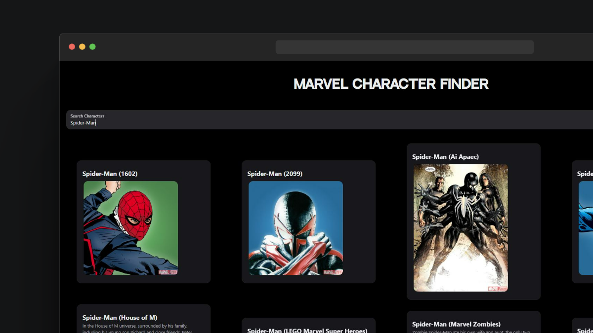
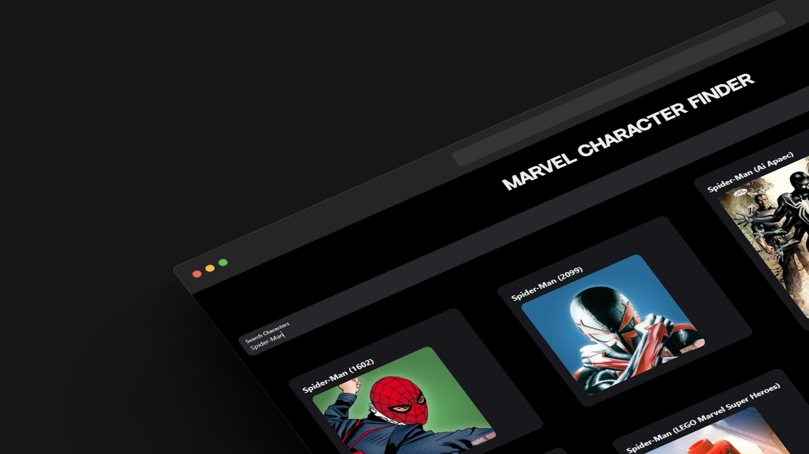

# Marvel Character Search App

This is a simple web application that allows users to search and view information about Marvel characters using the Marvel API.

## Features

- Display a list of Marvel characters with their names, images, descriptions, and number of comics available.
- Search for specific characters using a search bar.
- Fetches data from the Marvel API to provide up-to-date information.

## Technologies Used

- React: A JavaScript library for building user interfaces.
- NextUI: A UI library for React applications.
- Marvel API: Provides access to a wide range of Marvel comic data.
- JavaScript: Programming language used for application logic.
- HTML: Markup language for structuring the web application.
- CSS: Styling for a visually appealing user interface.

## Installation

1. Clone this repository: `git clone https://github.com/your-username/marvel-character-search.git`
2. Navigate to the project directory: `cd marvel-character-search`
3. Install dependencies: `npm install`

## Usage

1. Obtain a Marvel API key by signing up on the [Marvel Developer Portal](https://developer.marvel.com/).
2. Rename `.env.example` to `.env` and replace `YOUR_API_KEY` with your actual Marvel API key.
3. Start the development server: `npm start`
4. Open your browser and navigate to `http://localhost:3000` to access the application.

## Screenshots

_Description: The main page displaying a list of Marvel characters._

_Description: Searching for characters using the search bar._

## Contributing

Contributions are welcome! If you find any issues or want to add new features, please feel free to create a pull request.

## License

This project is licensed under the MIT License - see the [LICENSE](LICENSE) file for details.

---

Created by [Bryan Marroquin](https://github.com/bry4nma)
